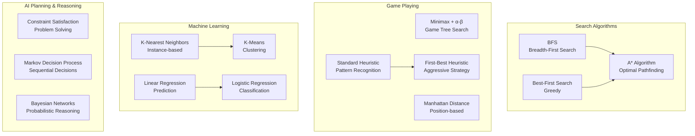
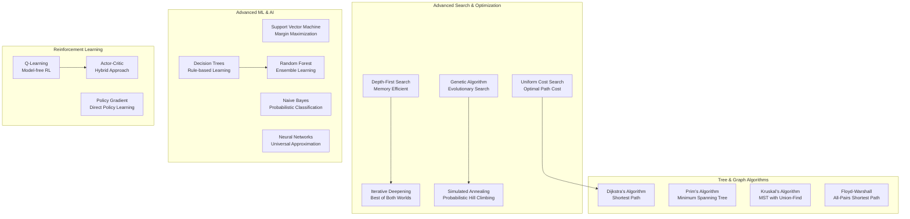

# 🧠 Comprehensive Algorithm Analysis & Comparison Guide

## 📋 Table of Contents

1. [Project Algorithms Overview](#project-algorithms-overview)
2. [Core Algorithm Comparison Matrix](#core-algorithm-comparison-matrix)
3. [Extended Algorithm Analysis](#extended-algorithm-analysis)
4. [Algorithm Category Comparisons](#algorithm-category-comparisons)
5. [Performance Metrics & Rankings](#performance-metrics--rankings)
6. [Algorithm Selection Decision Tree](#algorithm-selection-decision-tree)
7. [Real-World Applications](#real-world-applications)
8. [Benchmarks & Examples](#benchmarks--examples)

---

## 🎯 Project Algorithms Overview

### Connect4 Project Algorithms

- **Minimax with Alpha-Beta Pruning**: Game tree search for optimal moves
- **Standard Heuristic**: Pattern-based board evaluation
- **First-Best Heuristic**: Aggressive win-focused strategy
- **Manhattan Distance Heuristic**: Position-based evaluation

### Pyzzle Project Algorithms

- **A\* Algorithm**: Optimal pathfinding with heuristics
- **BFS (Breadth-First Search)**: Shortest path guarantee
- **Best-First Search**: Greedy heuristic-driven search
- **Manhattan Distance**: Grid-based distance calculation
- **Hamming Distance**: Simple misplacement counting

---

## 📊 Core Algorithm Comparison Matrix

| **Algorithm**                  | **Category** | **Purpose & Why Used**                                                   | **How It Works (Detailed)**                                                                                                                                                                  | **Comparison to Others**                                                                                                                             | **Examples**                                                                                                                                                         | **Complexity**                                     | **Pros/Cons**                                                                                                   | **Best Use Cases**                            |
| ------------------------------ | ------------ | ------------------------------------------------------------------------ | -------------------------------------------------------------------------------------------------------------------------------------------------------------------------------------------- | ---------------------------------------------------------------------------------------------------------------------------------------------------- | -------------------------------------------------------------------------------------------------------------------------------------------------------------------- | -------------------------------------------------- | --------------------------------------------------------------------------------------------------------------- | --------------------------------------------- |
| **BFS (Breadth-First Search)** | Search       | **Finds shortest path**<br/>Used when optimal solution length matters    | **Systematic Level Exploration:**<br/>1. Start from initial state<br/>2. Explore all neighbors at depth d<br/>3. Move to depth d+1<br/>4. Use queue (FIFO) for ordering                      | **vs DFS:** Finds optimal but uses more memory<br/>**vs A\*:** Slower but guarantees optimal<br/>**vs Best-First:** More systematic, optimal         | **15-Puzzle:** `[1,2,3,4,5,6,7,8,0,9,10,11,12,13,14,15]`<br/>→ `[1,2,3,4,5,6,7,8,9,0,10,11,12,13,14,15]`                                                             | **Time:** O(b^d)<br/>**Space:** O(b^d)             | **✅ Optimal solution**<br/>**✅ Complete**<br/>**❌ Memory intensive**<br/>**❌ Slow for deep goals**          | Small state spaces, shortest path needed      |
| **Best-First Search**          | Search       | **Fast goal-directed search**<br/>Uses heuristics to guide exploration   | **Greedy Heuristic-Driven:**<br/>1. Use priority queue<br/>2. Always expand most promising node<br/>3. Priority = h(n) only<br/>4. Ignore actual cost so far                                 | **vs BFS:** Much faster but not optimal<br/>**vs A\*:** Faster but less accurate<br/>**vs Dijkstra:** Uses heuristic guidance                        | **15-Puzzle with Manhattan:**<br/>State `[1,2,3,4,5,6,7,8,9,10,0,11,12,13,14,15]`<br/>h(n) = 1 (only one misplaced)                                                  | **Time:** O(b^m)<br/>**Space:** O(b^m)             | **✅ Fast**<br/>**✅ Memory efficient**<br/>**❌ Not optimal**<br/>**❌ Can get stuck**                         | Large state spaces, good heuristics available |
| **A\* Algorithm**              | Search       | **Optimal pathfinding**<br/>Combines actual cost + heuristic estimate    | **f(n) = g(n) + h(n) Evaluation:**<br/>1. g(n) = actual cost from start<br/>2. h(n) = heuristic estimate to goal<br/>3. Expand lowest f(n) first<br/>4. Maintains frontier + explored sets   | **vs Dijkstra:** Faster with heuristic<br/>**vs Best-First:** Optimal + complete<br/>**vs BFS:** Much more efficient                                 | **GPS Navigation:**<br/>From NYC to LA:<br/>g(n) = miles driven so far<br/>h(n) = straight-line distance to LA<br/>f(n) = total estimated trip cost                  | **Time:** O(b^d)<br/>**Space:** O(b^d)             | **✅ Optimal (admissible h)**<br/>**✅ Efficient**<br/>**❌ Needs good heuristic**<br/>**❌ Memory usage**      | Pathfinding, robotics, game AI                |
| **Minimax + α-β Pruning**      | Game Playing | **Optimal game decisions**<br/>Assumes rational opponent                 | **Game Tree Exploration:**<br/>1. MAX player maximizes score<br/>2. MIN player minimizes score<br/>3. α-β pruning cuts impossible branches<br/>4. Depth-limited with evaluation function     | **vs Monte Carlo:** Deterministic vs probabilistic<br/>**vs Q-Learning:** Model-based vs model-free<br/>**vs Simple heuristics:** Much stronger play | **Connect4 Example:**<br/>Depth 5, position evaluation<br/>α=-∞, β=+∞ initially<br/>Prune when α ≥ β                                                                 | **Time:** O(b^d) → O(b^(d/2))<br/>**Space:** O(bd) | **✅ Optimal play**<br/>**✅ Pruning efficiency**<br/>**❌ Exponential growth**<br/>**❌ Perfect info only**    | Chess, checkers, Connect4, tic-tac-toe        |
| **Standard Heuristic**         | Evaluation   | **Balanced game position assessment**<br/>Pattern-based evaluation       | **Window-Based Pattern Recognition:**<br/>1. Scan all 4-piece windows<br/>2. Count player/opponent pieces<br/>3. Assign scores based on threat level<br/>4. Sum all window evaluations       | **vs First-Best:** More balanced, less aggressive<br/>**vs Manhattan:** Pattern vs position focus<br/>**vs Random:** Much more strategic             | **Connect4 Window [1,1,1,0]:**<br/>3 player pieces + 1 empty = +50 points<br/>Window [2,2,2,0]: 3 opponent + 1 empty = -300 points                                   | **Time:** O(board_size)<br/>**Space:** O(1)        | **✅ Fast evaluation**<br/>**✅ Balanced strategy**<br/>**❌ Domain-specific**<br/>**❌ Manual tuning**         | Turn-based games, board evaluation            |
| **First-Best Heuristic**       | Evaluation   | **Aggressive win-focused strategy**<br/>Prioritizes immediate advantages | **Weighted Priority System:**<br/>1. Immediate wins: 100,000 points<br/>2. Block opponent wins: 90,000<br/>3. Create threats: 1,000<br/>4. Position control: 100<br/>5. Weighted combination | **vs Standard:** More aggressive, risk-taking<br/>**vs Manhattan:** Tactical vs positional<br/>**vs Min-Max:** Evaluation vs search method           | **Connect4 Priority:**<br/>Found winning move in column 3<br/>→ Return immediately with 100,000<br/>Found opponent threat in column 5<br/>→ Add 90,000 to evaluation | **Time:** O(board_size)<br/>**Space:** O(1)        | **✅ Strong tactical play**<br/>**✅ Fast decisions**<br/>**❌ Can miss strategy**<br/>**❌ Overly aggressive** | Tactical games, blitz play                    |
| **Manhattan Distance**         | Heuristic    | **Geometric distance estimation**<br/>Admissible pathfinding heuristic   | **Sum of Coordinate Differences:**<br/>1. For each misplaced tile<br/>2. Current position (x₁,y₁)<br/>3. Goal position (x₂,y₂)<br/>4. Distance = \|x₁-x₂\| + \|y₁-y₂\|                       | **vs Euclidean:** Grid-based vs straight-line<br/>**vs Hamming:** More informed estimate<br/>**vs Chebyshev:** Different movement model              | **15-Puzzle Tile 5:**<br/>Current: position (1,2)<br/>Goal: position (1,1)<br/>Manhattan = \|1-1\| + \|2-1\| = 1                                                     | **Time:** O(n)<br/>**Space:** O(1)                 | **✅ Admissible**<br/>**✅ Informative**<br/>**✅ Easy to compute**<br/>**❌ Grid-movement only**               | Sliding puzzles, grid pathfinding             |
| **Hamming Distance**           | Heuristic    | **Simple misplacement counting**<br/>Basic difference measure            | **Count Misplaced Elements:**<br/>1. Compare each position<br/>2. Count where state[i] ≠ goal[i]<br/>3. Ignore blank tile (position 0)<br/>4. Return total count                             | **vs Manhattan:** Less informed but faster<br/>**vs Levenshtein:** Position vs sequence<br/>**vs Jaccard:** Set vs sequence comparison               | **15-Puzzle State:**<br/>`[1,2,3,4,5,6,7,8,0,10,9,11,12,13,14,15]`<br/>Goal: `[1,2,3,4,5,6,7,8,9,10,0,11,12,13,14,15]`<br/>Hamming = 2 (tiles 9,10 wrong)            | **Time:** O(n)<br/>**Space:** O(1)                 | **✅ Very fast**<br/>**✅ Simple**<br/>**✅ Admissible**<br/>**❌ Less informative**                            | Quick estimation, simple puzzles              |

---

## 🔬 Extended Algorithm Analysis

### Machine Learning Algorithms

| **Algorithm**                 | **Category**     | **Purpose & Why Used**                                                   | **How It Works (Detailed)**                                                                                                                                                                      | **Comparison to Others**                                                                                                                       | **Examples**                                                                                                                                                         | **Complexity**                            | **Pros/Cons**                                                                                                                         | **Best Use Cases**                          |
| ----------------------------- | ---------------- | ------------------------------------------------------------------------ | ------------------------------------------------------------------------------------------------------------------------------------------------------------------------------------------------ | ---------------------------------------------------------------------------------------------------------------------------------------------- | -------------------------------------------------------------------------------------------------------------------------------------------------------------------- | ----------------------------------------- | ------------------------------------------------------------------------------------------------------------------------------------- | ------------------------------------------- |
| **K-Nearest Neighbors (KNN)** | Machine Learning | **Instance-based classification**<br/>Classify based on similar examples | **Similarity-Based Prediction:**<br/>1. Store all training examples<br/>2. For new instance, find K closest<br/>3. Use distance metric (Euclidean, etc.)<br/>4. Majority vote for classification | **vs SVM:** Lazy vs eager learning<br/>**vs Decision Trees:** Instance vs rule-based<br/>**vs Neural Networks:** Simple vs complex             | **Email Spam Detection:**<br/>New email features: [word_count=50, links=2]<br/>K=3 nearest: [spam, not_spam, spam]<br/>Prediction: spam (majority)                   | **Time:** O(nd) query<br/>**Space:** O(n) | **✅ Simple, intuitive**<br/>**✅ No assumptions**<br/>**❌ Slow queries**<br/>**❌ Curse of dimensionality**                         | Recommendation systems, pattern recognition |
| **Linear Regression**         | Machine Learning | **Continuous value prediction**<br/>Model linear relationships           | **Least Squares Optimization:**<br/>1. y = β₀ + β₁x₁ + β₂x₂ + ... + ε<br/>2. Minimize Σ(yᵢ - ŷᵢ)²<br/>3. Find optimal β coefficients<br/>4. Use for prediction                                   | **vs Polynomial:** Linear vs curved relationships<br/>**vs Logistic:** Continuous vs categorical<br/>**vs SVR:** Linear vs non-linear kernels  | **House Price Prediction:**<br/>Price = 50,000 + 100×(sqft) + 5,000×(bedrooms)<br/>For 1500 sqft, 3 bed:<br/>Price = 50,000 + 150,000 + 15,000 = $215,000            | **Time:** O(n³)<br/>**Space:** O(n²)      | **✅ Interpretable**<br/>**✅ Fast training**<br/>**❌ Linear assumption**<br/>**❌ Sensitive to outliers**                           | Sales forecasting, risk analysis            |
| **Logistic Regression**       | Machine Learning | **Binary/multi-class classification**<br/>Probabilistic classification   | **Sigmoid Function Modeling:**<br/>1. p = 1/(1 + e^(-z))<br/>2. z = β₀ + β₁x₁ + β₂x₂ + ...<br/>3. Maximum likelihood estimation<br/>4. Output probability [0,1]                                  | **vs Linear:** Classification vs regression<br/>**vs SVM:** Probabilistic vs margin-based<br/>**vs Naive Bayes:** Discriminative vs generative | **Medical Diagnosis:**<br/>P(disease) = 1/(1 + e^(-(1.2 + 0.5×age - 0.3×exercise)))<br/>For age=50, exercise=3:<br/>P = 1/(1 + e^(-2.3)) = 0.91                      | **Time:** O(np)<br/>**Space:** O(p)       | **✅ Probabilistic output**<br/>**✅ No distribution assumptions**<br/>**❌ Linear decision boundary**<br/>**❌ Needs large samples** | Medical diagnosis, marketing                |
| **K-Means Clustering**        | Machine Learning | **Unsupervised grouping**<br/>Find natural data clusters                 | **Iterative Centroid Optimization:**<br/>1. Initialize K cluster centers<br/>2. Assign points to nearest center<br/>3. Update centers to cluster mean<br/>4. Repeat until convergence            | **vs Hierarchical:** Flat vs tree clustering<br/>**vs DBSCAN:** Centroid vs density-based<br/>**vs Gaussian Mixture:** Hard vs soft assignment | **Customer Segmentation:**<br/>Features: [age, income]<br/>Cluster 1: Young, low income<br/>Cluster 2: Middle-aged, high income<br/>Cluster 3: Senior, medium income | **Time:** O(nkdi)<br/>**Space:** O(nk)    | **✅ Simple, fast**<br/>**✅ Scalable**<br/>**❌ Need to choose K**<br/>**❌ Sensitive to initialization**                            | Market segmentation, image compression      |

### Advanced Search & Optimization

| **Algorithm**                | **Category** | **Purpose & Why Used**                                                 | **How It Works (Detailed)**                                                                                                                                                                                                   | **Comparison to Others**                                                                                                                                                    | **Examples**                                                                                                                                                                                     | **Complexity**                                                               | **Pros/Cons**                                                                                                                       | **Best Use Cases**                             |
| ---------------------------- | ------------ | ---------------------------------------------------------------------- | ----------------------------------------------------------------------------------------------------------------------------------------------------------------------------------------------------------------------------- | --------------------------------------------------------------------------------------------------------------------------------------------------------------------------- | ------------------------------------------------------------------------------------------------------------------------------------------------------------------------------------------------ | ---------------------------------------------------------------------------- | ----------------------------------------------------------------------------------------------------------------------------------- | ---------------------------------------------- |
| **Depth-First Search (DFS)** | Search       | **Memory-efficient exploration**<br/>Deep path exploration first       | **Stack-Based Deep Traversal:**<br/>1. Start from initial state<br/>2. Go as deep as possible<br/>3. Backtrack when stuck<br/>4. Use stack (LIFO) or recursion                                                                | **vs BFS:** Memory efficient but not optimal<br/>**vs A\*:** No heuristic guidance<br/>**vs IDS:** Can get stuck in infinite paths                                          | **Maze Solving:**<br/>Path: Start → Right → Down → Down → Right → Goal<br/>Explores one path completely before trying others                                                                     | **Time:** O(b^m)<br/>**Space:** O(bm)                                        | **✅ Low memory usage**<br/>**✅ Finds solution quickly if lucky**<br/>**❌ Not optimal**<br/>**❌ Can loop infinitely**            | Tree traversal, topological sorting            |
| **Dijkstra's Algorithm**     | Graph        | **Single-source shortest paths**<br/>Optimal distances from one source | **Greedy Shortest Path Expansion:**<br/>1. Initialize distances to ∞, source to 0<br/>2. Use min-heap priority queue<br/>3. Extract minimum, update neighbors<br/>4. Relaxation: if d[u] + w(u,v) < d[v]                      | **vs A\*:** No heuristic, explores all directions<br/>**vs BFS:** Handles weighted graphs<br/>**vs Floyd-Warshall:** Single vs all sources                                  | **GPS Navigation Network:**<br/>From home to all destinations:<br/>Home→Store: 5 min<br/>Home→Work: 15 min<br/>Store→Work: 8 min<br/>Optimal paths computed                                      | **Time:** O((V+E)logV)<br/>**Space:** O(V)                                   | **✅ Optimal shortest paths**<br/>**✅ Handles positive weights**<br/>**❌ Explores all directions**<br/>**❌ No negative weights** | Network routing, GPS systems                   |
| **Genetic Algorithm**        | Optimization | **Evolutionary optimization**<br/>Bio-inspired search for solutions    | **Evolution Simulation:**<br/>1. Initialize random population<br/>2. Fitness evaluation<br/>3. Selection (roulette, tournament)<br/>4. Crossover (combine parents)<br/>5. Mutation (random changes)<br/>6. Repeat generations | **vs Hill Climbing:** Population vs single solution<br/>**vs Simulated Annealing:** Evolution vs temperature<br/>**vs Gradient Descent:** Derivative-free vs gradient-based | **Traveling Salesman Problem:**<br/>Chromosome: [City1, City3, City2, City4]<br/>Crossover: Parent1[1:3] + Parent2[remaining]<br/>Mutation: Swap two random cities<br/>Fitness: 1/total_distance | **Time:** O(generations × population × fitness)<br/>**Space:** O(population) | **✅ Global optimization**<br/>**✅ No derivative needed**<br/>**❌ No convergence guarantee**<br/>**❌ Many parameters to tune**   | Optimization problems, neural network training |

### AI Planning & Reasoning

| **Algorithm**                              | **Category**           | **Purpose & Why Used**                                                             | **How It Works (Detailed)**                                                                                                                                                                                             | **Comparison to Others**                                                                                                                                     | **Examples**                                                                                                                                                                 | **Complexity**                                        | **Pros/Cons**                                                                                                                              | **Best Use Cases**                         |
| ------------------------------------------ | ---------------------- | ---------------------------------------------------------------------------------- | ----------------------------------------------------------------------------------------------------------------------------------------------------------------------------------------------------------------------- | ------------------------------------------------------------------------------------------------------------------------------------------------------------ | ---------------------------------------------------------------------------------------------------------------------------------------------------------------------------- | ----------------------------------------------------- | ------------------------------------------------------------------------------------------------------------------------------------------ | ------------------------------------------ |
| **Constraint Satisfaction Problems (CSP)** | AI Planning            | **Constraint-based problem solving**<br/>Find solutions satisfying all constraints | **Backtracking with Constraint Propagation:**<br/>1. Variables, domains, constraints<br/>2. Assign variables one by one<br/>3. Check constraint violations<br/>4. Backtrack when stuck<br/>5. Use heuristics (MRV, LCV) | **vs Search:** Constraint vs goal-based<br/>**vs Optimization:** Feasibility vs optimality<br/>**vs SAT:** General vs boolean constraints                    | **Sudoku Solving:**<br/>Variables: 81 cells<br/>Domains: {1,2,3,4,5,6,7,8,9}<br/>Constraints: Row/column/box uniqueness<br/>Backtrack + constraint propagation               | **Time:** O(d^n) worst<br/>**Space:** O(n)            | **✅ Systematic**<br/>**✅ Optimal pruning**<br/>**❌ Exponential worst-case**<br/>**❌ Hard constraint modeling**                         | Scheduling, puzzle solving, configuration  |
| **Markov Decision Process (MDP)**          | AI Planning            | **Sequential decision making**<br/>Optimal policies under uncertainty              | **Dynamic Programming for Policies:**<br/>1. States S, Actions A, Transitions P<br/>2. Rewards R, Discount factor γ<br/>3. V\*(s) = max_a Σ P(s'\|s,a)[R + γV\*(s')]<br/>4. Policy π\*(s) = argmax_a Q\*(s,a)           | **vs Q-Learning:** Model-based vs model-free<br/>**vs Monte Carlo:** Full vs sampling-based<br/>**vs Bandits:** Sequential vs single-step                    | **Robot Navigation:**<br/>States: Grid positions<br/>Actions: {North, South, East, West}<br/>Rewards: +100 (goal), -1 (step), -100 (pit)<br/>Policy: Optimal path to goal    | **Time:** O(\|S\|²\|A\|)<br/>**Space:** O(\|S\|\|A\|) | **✅ Optimal policy**<br/>**✅ Handles uncertainty**<br/>**❌ Requires model**<br/>**❌ Curse of dimensionality**                          | Robotics, game AI, resource allocation     |
| **Bayesian Networks**                      | AI Reasoning           | **Probabilistic reasoning**<br/>Model dependencies and inference                   | **Directed Acyclic Graph (DAG) with CPTs:**<br/>1. Nodes = random variables<br/>2. Edges = direct dependencies<br/>3. Conditional Probability Tables<br/>4. Joint distribution factorization                            | **vs Neural Networks:** Interpretable vs black-box<br/>**vs Decision Trees:** Probabilistic vs deterministic<br/>**vs Markov Models:** General vs sequential | **Medical Diagnosis:**<br/>Flu → Fever, Headache<br/>P(Flu=true) = 0.1<br/>P(Fever=true\|Flu=true) = 0.9<br/>P(Fever=true\|Flu=false) = 0.2<br/>Inference: P(Flu\|Fever) = ? | **Time:** O(2^n) worst<br/>**Space:** O(2^n)          | **✅ Interpretable**<br/>**✅ Handles uncertainty**<br/>**❌ Learning structure hard**<br/>**❌ Exponential inference**                    | Expert systems, diagnosis, risk assessment |
| **Q-Learning**                             | Reinforcement Learning | **Model-free optimal control**<br/>Learn optimal policy through interaction        | **Temporal Difference Learning:**<br/>1. Q(s,a) ← Q(s,a) + α[r + γmax Q(s',a') - Q(s,a)]<br/>2. ε-greedy exploration vs exploitation<br/>3. No model of environment needed<br/>4. Converges to optimal Q\*              | **vs Policy Gradient:** Value vs policy-based<br/>**vs MDP:** Model-free vs model-based<br/>**vs Monte Carlo:** Online vs batch updates                      | **Game Playing Agent:**<br/>State: Board position<br/>Action: Move choice<br/>Reward: +1 (win), -1 (loss), 0 (continue)<br/>Learn Q(state, move) values through play         | **Time:** O(\|S\|\|A\|)<br/>**Space:** O(\|S\|\|A\|)  | **✅ Model-free learning**<br/>**✅ Guaranteed convergence**<br/>**❌ Needs exploration strategy**<br/>**❌ Large state spaces difficult** | Game AI, robotics, autonomous systems      |

---

## 📈 Algorithm Category Comparisons

### Search Algorithms Performance

```
Optimality: A* > BFS > Best-First
Speed: Best-First > A* > BFS
Memory: Best-First < A* ≈ BFS
```

### Game Playing Strength

```
Playing Strength: Minimax+αβ >> First-Best > Standard > Random
Computation: Standard < First-Best < Minimax+αβ
Versatility: Standard > First-Best > Minimax+αβ
```

### Machine Learning Suitability

```
Interpretability: Linear Reg > Logistic Reg > KNN > K-Means
Training Speed: KNN (none) > K-Means > Linear > Logistic
Prediction Speed: Linear ≈ Logistic > KNN > K-Means
```

---

## 🎯 Performance Metrics & Rankings

### Search Algorithm Efficiency Ranking

```
Memory Efficiency: DFS > IDS > A* > BFS > UCS
Optimality Guarantee: A* = BFS = UCS = IDS > DFS
Time Efficiency (good heuristic): A* > Best-First > UCS > BFS > IDS > DFS
Time Efficiency (no heuristic): BFS = UCS > IDS > DFS > A* > Best-First
```

### Machine Learning Algorithm Characteristics

```
Training Speed: Naive Bayes > KNN > Linear > Logistic > Decision Tree > SVM > Random Forest > Neural Networks
Prediction Speed: Linear = Logistic > Naive Bayes > Decision Tree > SVM > KNN > Random Forest > Neural Networks
Interpretability: Decision Tree > Linear Reg > Logistic > Naive Bayes > SVM > Random Forest > KNN > Neural Networks
Handling Non-linearity: Neural Networks > SVM (RBF) > Random Forest > Decision Tree > KNN > Naive Bayes > Linear Models
```

### Optimization Algorithm Scope

```
Global Search Capability: Genetic Algorithm > Simulated Annealing > Random Search > Hill Climbing
Convergence Speed: Hill Climbing > Simulated Annealing > Genetic Algorithm > Random Search
Memory Requirements: Hill Climbing = Simulated Annealing < Random Search < Genetic Algorithm
Parameter Sensitivity: Hill Climbing < Simulated Annealing < Genetic Algorithm < Random Search
```

---

## 🌳 Algorithm Selection Decision Tree

```
Problem Type?
├─ Pathfinding/Search
│   ├─ Optimal Solution Required?
│   │   ├─ Yes + Small Space: BFS
│   │   ├─ Yes + Large Space + Good Heuristic: A*
│   │   └─ Yes + Weighted Edges: Dijkstra/UCS
│   └─ Fast Solution Acceptable?
│       ├─ Memory Constrained: DFS
│       └─ Good Heuristic Available: Best-First
│
├─ Game Playing
│   ├─ Perfect Information: Minimax + α-β Pruning
│   ├─ Imperfect Information: Monte Carlo Tree Search
│   └─ Real-time Constraints: Heuristic Evaluation (First-Best/Standard)
│
├─ Machine Learning
│   ├─ Supervised Learning
│   │   ├─ Linear Relationship: Linear/Logistic Regression
│   │   ├─ Need Interpretability: Decision Trees
│   │   ├─ Small Dataset: Naive Bayes
│   │   ├─ High Performance: Random Forest/SVM
│   │   └─ Complex Patterns: Neural Networks
│   ├─ Unsupervised Learning
│   │   ├─ Clustering: K-Means
│   │   └─ Similarity-based: KNN
│   └─ Reinforcement Learning
│       ├─ Model Available: MDP (Value/Policy Iteration)
│       └─ Model-free: Q-Learning
│
└─ Optimization
    ├─ Continuous + Differentiable: Gradient Descent
    ├─ Discrete + Small Space: Exhaustive Search
    ├─ Large Space + Local OK: Hill Climbing
    ├─ Large Space + Global Needed: Genetic Algorithm
    └─ Constraint-based: CSP Backtracking
```

---

## 🌍 Real-World Application Matrix

| **Domain**                      | **Best Algorithms**                    | **Why**                                          |
| ------------------------------- | -------------------------------------- | ------------------------------------------------ |
| **Game AI**                     | Minimax + αβ, First-Best Heuristic     | Optimal play, tactical strength                  |
| **Pathfinding**                 | A\*, Manhattan Distance                | Optimal routes, efficient search                 |
| **Puzzle Solving**              | A\*, BFS, CSP                          | Guaranteed solutions, constraint handling        |
| **Recommendation**              | KNN, K-Means                           | Similarity-based, user clustering                |
| **Risk Assessment**             | Bayesian Networks, Logistic Regression | Uncertainty handling, probabilistic reasoning    |
| **Business Forecasting**        | Linear Regression, MDP                 | Trend prediction, sequential decisions           |
| **Image Recognition**           | Neural Networks, SVM                   | Pattern recognition, non-linear classification   |
| **Natural Language Processing** | Neural Networks, Naive Bayes           | Text understanding, probabilistic classification |
| **Robotics**                    | A\*, MDP, Q-Learning                   | Path planning, decision making under uncertainty |
| **Network Routing**             | Dijkstra, Floyd-Warshall               | Shortest paths, network optimization             |

---

## 📊 Benchmarks & Examples

### Connect4 AI Performance

- **Minimax (depth 7) + First-Best Heuristic**: ~95% win rate vs random
- **Minimax (depth 5) + Standard Heuristic**: ~85% win rate vs random
- **Pure First-Best Heuristic**: ~70% win rate vs random
- **Random Play**: 50% baseline

### 15-Puzzle Solving Efficiency

- **A\* + Manhattan**: ~1000 nodes explored, optimal solution
- **Best-First + Manhattan**: ~500 nodes explored, may not be optimal
- **BFS**: ~50,000 nodes explored, optimal solution
- **DFS**: May never find solution due to infinite paths

### Machine Learning Benchmark (Iris Dataset)

- **SVM (RBF kernel)**: 98% accuracy
- **Random Forest**: 97% accuracy
- **Decision Tree**: 95% accuracy
- **Naive Bayes**: 94% accuracy
- **KNN (k=3)**: 96% accuracy
- **Logistic Regression**: 95% accuracy

### Algorithm Diagrams

#### Core Project Algorithms



#### Extended Algorithm Network



---

## 📝 Standard Heuristic Deep Dive

### How Standard Heuristic Works in Connect4

The **Standard Heuristic** is a window-based evaluation function that systematically examines all possible 4-piece winning combinations:

#### 1. Window Scanning Strategy

```python
# Horizontal windows (rows)
for row in range(6):
    for col in range(4):  # columns 0-3, 1-4, 2-5, 3-6
        window = state[row][col:col+4]

# Vertical windows
for row in range(3):  # rows 0-3, 1-4, 2-5
    for col in range(7):
        window = [state[row+i][col] for i in range(4)]

# Diagonal windows (top-left to bottom-right)
for row in range(3):
    for col in range(4):
        window = [state[row+i][col+i] for i in range(4)]

# Diagonal windows (bottom-left to top-right)
for row in range(3, 6):
    for col in range(4):
        window = [state[row-i][col+i] for i in range(4)]
```

#### 2. Window Evaluation Scoring

**For YOUR pieces:**

- **4 pieces in a row**: `+1000` points (WIN!)
- **3 pieces + 1 empty**: `+50` points (one move from winning)
- **2 pieces + 2 empty**: `+20` points (good potential)
- **1 piece + 3 empty**: `+5` points (basic presence)

**For OPPONENT's pieces (defensive):**

- **3 pieces + 1 empty**: `-300` points (MUST BLOCK!)
- **2 pieces + 2 empty**: `-90` points (watch this threat)
- **1 piece + 3 empty**: `-80` points (minor concern)

#### 3. Example Evaluation

Window: `[1, 1, 1, 0]` (where 1 = your piece, 0 = empty)

```
player_count = 3      # Three of your pieces
empty_count = 1       # One empty spot
opponent_count = 0    # No opponent pieces

Result: +50 points (you're one move from winning!)
```

---

This comprehensive guide provides everything needed to understand, compare, and select the appropriate algorithm for any given problem domain! 🚀

_Generated from analysis of Connect4 and Pyzzle projects with comprehensive algorithm research._
